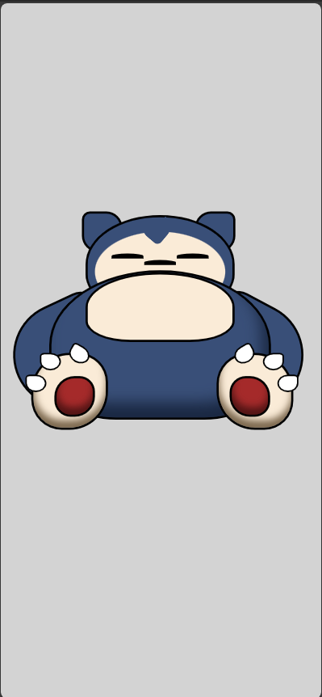

### SNORLAX

*Conceitos utilizados:*

- Responsividade
- Position
- Camadas

*Interface:*

*Resultado final:*

Desktop:
 

Mobile:
 

*Observações:*

- Projeto desenvolvido exclusivamente para estudo.

---
